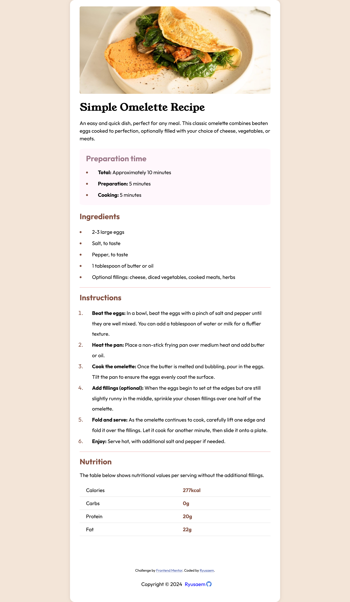

# Frontend Mentor - Recipe page solution

This is a solution to the [Recipe page challenge on Frontend Mentor](https://www.frontendmentor.io/challenges/recipe-page-KiTsR8QQKm). Frontend Mentor challenges help you improve your coding skills by building realistic projects.

## Table of contents

- [Overview](#overview)
  - [Screenshot](#screenshot)
  - [Links](#links)
- [My process](#my-process)
  - [Built with](#built-with)
  - [What I learned](#what-i-learned)
  - [Continued development](#continued-development)
  - [Useful resources](#useful-resources)
- [Author](#author)

## Overview

### Screenshot

Screenshot by using Firefox to view your project, right-click the page and select "Take a Screenshot".

### Links

- Solution URL: [Github](https://github.com/Ryusaem/html-recipe-page)
- Live Site URL: [Github Live](https://your-live-site-url.com)

## My process

- Looking to build the structure of the website with Flexbox only.
- Creating a main container to put all content inside of it.
- Breaking the main container into "header", "main" and "footer".
  - "header" will contain the image of the recipe
  - "main" will contain all the rest of the content, like all h1, h2, p, ul, ol, table
  - "footer" will contain my personal signature

### Built with

- Semantic HTML5 markup
- CSS custom properties
- Flexbox
- Mobile-first workflow

### What I learned

I have learned to better structure my HTML page, and improve my understanding of media query by allowing the website to be responsive.
I also learned to play with custom variable and grasp a better understanding of the CSS property "max-width" which was very useful for the responsive side.

### Continued development

I need to improve my understanding of "media query" and be able to make my website responsive without being afraid of breaking down everything.
I should also improve my way of organizing my HTML element to make them much more efficient and easier to understand. For example using much more properly the idea of class and ID.
I should also use "section" element more, instead of using "div" for clarity purpose.

### Useful resources

- [Frontend Mentor](https://www.frontendmentor.io/challenges/recipe-page-KiTsR8QQKm) - Formidable resources to make you learn by "doing" awesome project. Highly recommend it.
- [Mardown Guide](https://www.markdownguide.org/) - Allow you to write better README file.
- [Flexbox Froggy](https://flexboxfroggy.com/) - Amazing game to help you become more familiar with flexbox property.

## Author

- Github - [@Ryusaem](https://github.com/Ryusaem)
- Linkedin - [@sambath-meas](https://www.linkedin.com/in/sambath-meas)
- Coursera - [@sambath-meas](https://www.coursera.org/learner/sambath-meas)
- Twitter - [@RyuBraveheart](https://twitter.com/RyuBraveheart)
- Frontend Mentor - [@Ryusaem](https://www.frontendmentor.io/profile/Ryusaem)
- CodeWars - [@Ryusaem](https://www.codewars.com/users/Ryusaem)
